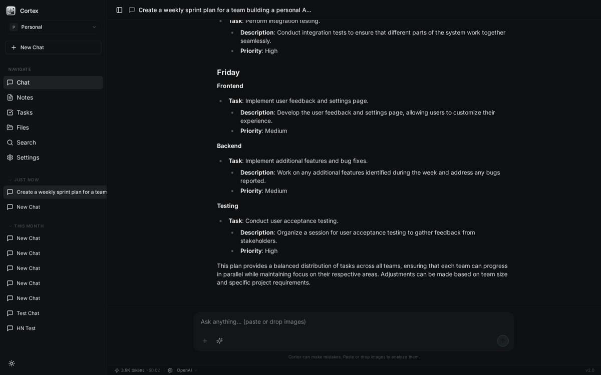
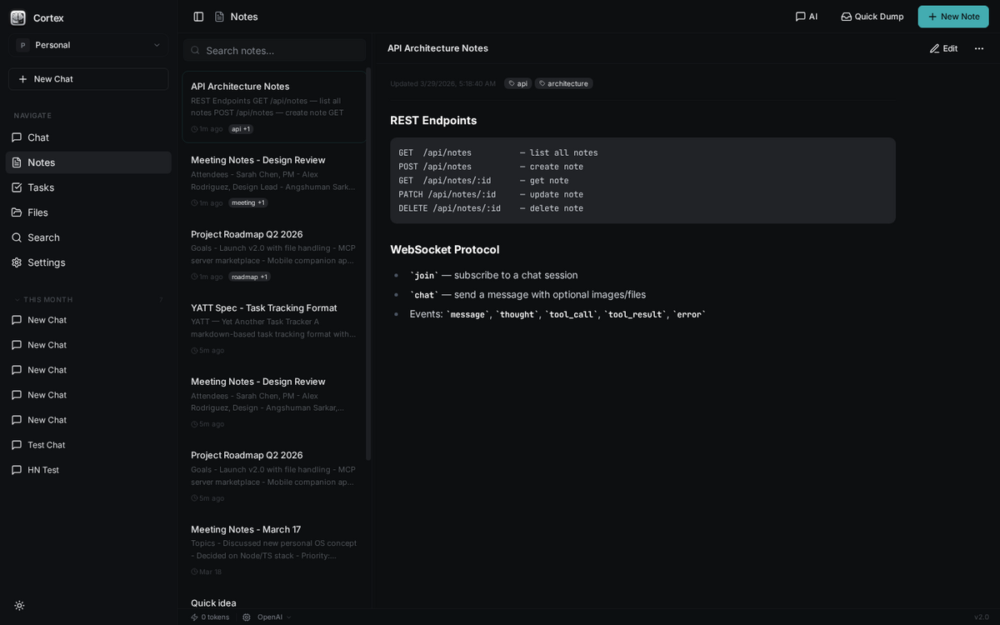
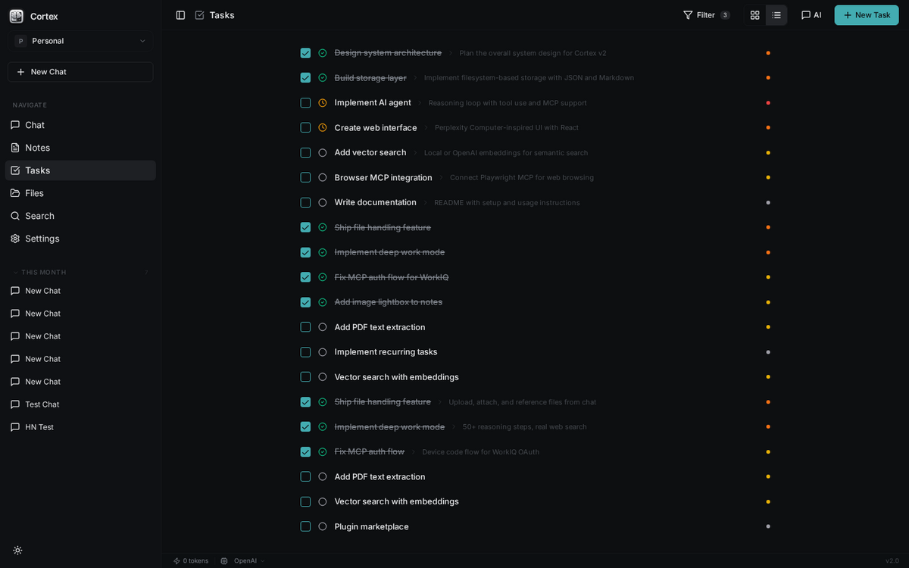
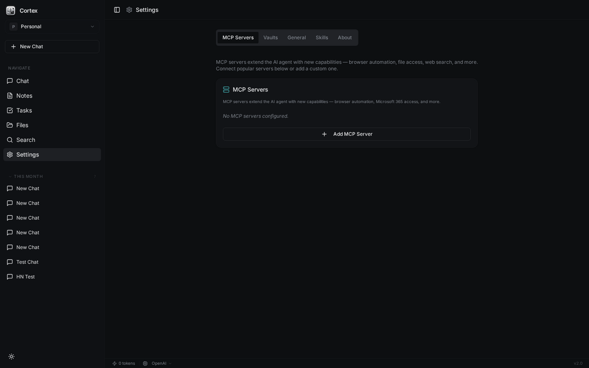

# Cortex — Personal AI Operating System

[](https://www.npmjs.com/package/cortex-md)
[](https://github.com/angshuman/cortex/releases/latest)
[](https://github.com/angshuman/cortex/releases/latest)
[](https://github.com/angshuman/cortex/actions)

A local-first personal operating system with an AI reasoner, note-taking, task management, file handling, and browser automation via MCP. Your data stays on your machine.

<p align="center">
  
</p>

---

## Install & Run

### Option 1 — npx (no install required)

```bash
npx cortex-md
```

The first run downloads Electron (~100 MB) and caches it. Subsequent runs are instant.

### Option 2 — Global install

```bash
npm install -g cortex-md
cortex-md
```

### Option 3 — Download a pre-built binary

**[Go to the Releases page](https://github.com/angshuman/cortex/releases/latest)**

| Platform | Architecture | Download |
|----------|-------------|----------|
| **Windows** | x64 / ARM64 | [Cortex-Setup.exe](https://github.com/angshuman/cortex/releases/latest/download/Cortex-Setup-1.1.1.exe) |
| **macOS** | Apple Silicon | [Cortex-arm64.dmg](https://github.com/angshuman/cortex/releases/latest/download/Cortex-1.1.1-arm64.dmg) |
| **macOS** | Intel | [Cortex.dmg](https://github.com/angshuman/cortex/releases/latest/download/Cortex-1.1.1.dmg) |
| **Linux** | x64 | [Cortex.AppImage](https://github.com/angshuman/cortex/releases/latest/download/Cortex-1.1.1.AppImage) |
| **Linux** | ARM64 | [Cortex-arm64.AppImage](https://github.com/angshuman/cortex/releases/latest/download/Cortex-1.1.1-arm64.AppImage) |
| **Linux** | x64 (deb) | [cortex_amd64.deb](https://github.com/angshuman/cortex/releases/latest/download/cortex_1.1.1_amd64.deb) |
| **Linux** | ARM64 (deb) | [cortex_arm64.deb](https://github.com/angshuman/cortex/releases/latest/download/cortex_1.1.1_arm64.deb) |

> On first launch, a setup dialog asks for an API key (OpenAI, Anthropic, xAI, or Google Gemini). No environment variables needed.

---

## Features

<table>
<tr>
<td width="50%">

### AI Chat
Deep reasoning with tool use. The agent can search the web, create notes, manage tasks, browse websites, and work through complex multi-step problems — taking as many steps as needed.



</td>
<td width="50%">

### Notes
Full markdown editor with image support, tags, and search. Paste images directly, view them in a lightbox, and chat about your notes with the AI.



</td>
</tr>
<tr>
<td width="50%">

### Tasks
List and Kanban views with drag-and-drop. Priority levels, due dates, subtasks, and status tracking. The AI can create and manage tasks from chat.



</td>
<td width="50%">

### Settings & MCP
Multi-provider AI support (OpenAI, Claude, Grok, Gemini). MCP server integration for browser automation, Microsoft 365 access, and custom tools.



</td>
</tr>
</table>

### More Features

- **Files** — Upload, preview, and reference files from chat. Supports images, PDFs, Word, Excel, and more.
- **Web Search** — DuckDuckGo-powered search built into the agent. Fetch and read any URL.
- **Multi-Vault** — Separate workspaces for personal, work, or project data. Sync with OneDrive or USB.
- **Image Vision** — Paste screenshots into chat or notes. The AI can see and analyze images.
- **MCP Servers** — Playwright browser automation, WorkIQ for Microsoft 365, or add any custom MCP server.
- **Skills System** — Built-in and custom skills define what tools the AI can use.
- **Portable Data** — Everything is JSON and Markdown files on disk. Navigable, portable, no lock-in.
- **Cost Tracking** — Token counter and estimated API cost in the status bar.
- **Cross-Platform** — Windows (.exe installer + portable), macOS (.dmg), Linux (AppImage + .deb).

---

## Download

**[Go to Releases](https://github.com/angshuman/cortex/releases/latest)**

| Platform | Download |
|----------|----------|
| **Windows** (x64/ARM64) | [Cortex-Setup.exe](https://github.com/angshuman/cortex/releases/latest) |
| **Windows** (portable) | [Cortex-portable.exe](https://github.com/angshuman/cortex/releases/latest) |
| **macOS** (Apple Silicon) | [Cortex-arm64.dmg](https://github.com/angshuman/cortex/releases/latest) |
| **macOS** (Intel) | [Cortex.dmg](https://github.com/angshuman/cortex/releases/latest) |
| **Linux** (x64) | [Cortex.AppImage](https://github.com/angshuman/cortex/releases/latest) |

> On first launch, add an API key (OpenAI, Anthropic, xAI, or Google Gemini) in Settings.

---

## Quick Start

```bash
git clone https://github.com/angshuman/cortex.git
cd cortex
npm install
npm run dev          # → http://localhost:5000
```

### Electron Desktop App

```bash
npm run electron:dev           # Dev mode
npm run electron:pack:win      # Package for Windows
npm run electron:pack:mac      # Package for macOS
npm run electron:pack:linux    # Package for Linux
```

### Environment Variables

| Variable | Description |
|---|---|
| `OPENAI_API_KEY` | OpenAI API key |
| `ANTHROPIC_API_KEY` | Claude API key |
| `GROK_API_KEY` | Grok/xAI API key |
| `GOOGLE_API_KEY` | Google Gemini API key |
| `CORTEX_DATA_DIR` | Custom data directory (default: `.cortex-data/`) |

---

## Architecture

```
cortex/
├── client/          React + Vite + Tailwind + shadcn/ui
├── server/          Express + TypeScript + WebSocket
├── electron/        Electron main process + preload
├── shared/          Shared TypeScript schemas
└── dist/            Build output
```

- **No database** — JSON and Markdown files on disk
- **AI agent** — Agentic loop with unlimited tool-use steps
- **WebSocket** — Streams thoughts, tool calls, and responses in real-time
- **MCP** — Model Context Protocol for browser, Microsoft 365, and custom integrations
- **Skills** — Pluggable tool definitions with instructions and parameters

### AI Providers

| Provider | Model | Input/1M | Output/1M |
|----------|-------|----------|-----------|
| OpenAI | gpt-4o | $2.50 | $10.00 |
| Anthropic | claude-sonnet-4 | $3.00 | $15.00 |
| xAI | grok-3 | $3.00 | $15.00 |
| Google | gemini-2.0-flash | $0.10 | $0.40 |

---

## License

MIT
